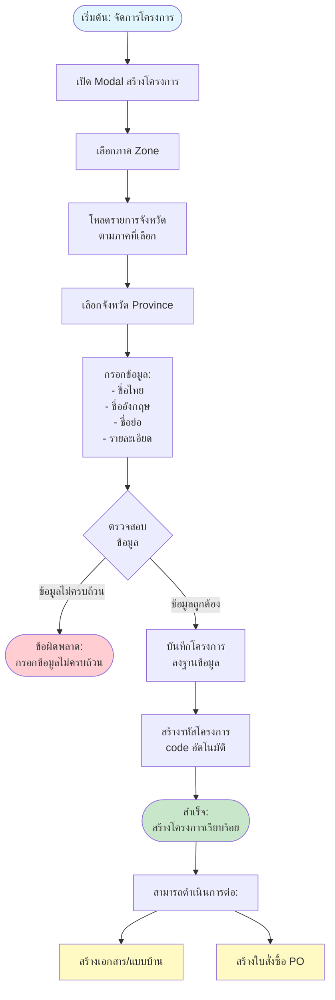
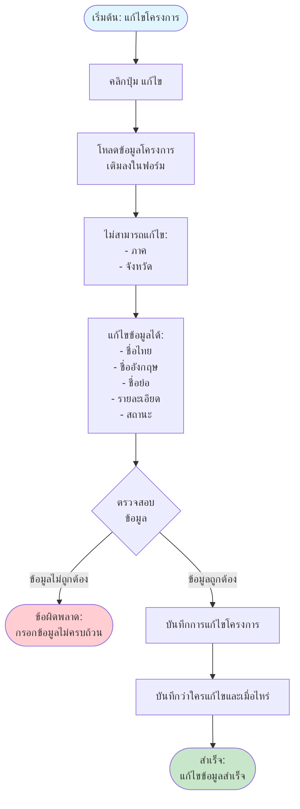
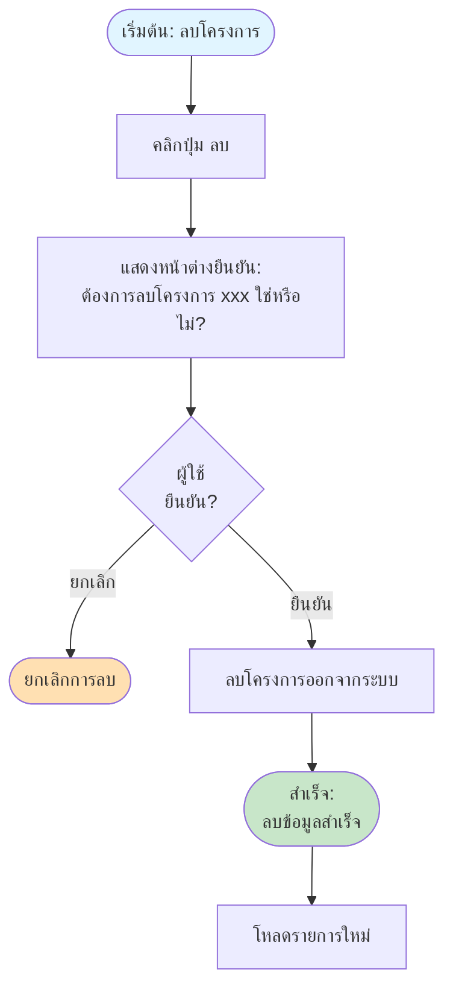

# Project Flow - การจัดการโครงการ

## Overview
การจัดการโครงการ เป็นการสร้างและจัดการข้อมูลโครงการต่างๆ โดยโครงการจะถูกจัดกลุ่มตามภาคและจังหวัด ซึ่งเป็นข้อมูลพื้นฐานที่จำเป็นสำหรับการสร้างใบสั่งซื้อ

## Flowchart

## Process Steps

### 1. เปิดหน้าต่างสร้างโครงการ
- คลิกปุ่ม "เพิ่มโครงการ"
- ระบบจะเปิดหน้าต่างสำหรับกรอกข้อมูล

### 2. เลือกภาค
- **เงื่อนไข**: ต้องเลือกภาคก่อน
- ระบบจะแสดงรายการภาคที่ใช้งาน
- เลือกภาคจากรายการ:
  - ภาคเหนือ
  - ภาคกลาง
  - ภาคตะวันออกเฉียงเหนือ (อีสาน)
  - ภาคใต้
  - ฯลฯ

### 3. แสดงรายการจังหวัด
- เมื่อเลือกภาคแล้ว ระบบจะแสดงรายการจังหวัดในภาคนั้นอัตโนมัติ
- แสดงเฉพาะจังหวัดที่ใช้งานและอยู่ในภาคที่เลือก
- แสดงในรายการจังหวัด

### 4. เลือกจังหวัด
- **เงื่อนไข**: ต้องเลือกจังหวัด
- เลือกจังหวัดจากรายการที่แสดง
- จังหวัดจะไม่สามารถเลือกได้ถ้ายังไม่ได้เลือกภาค

### 5. กรอกข้อมูลโครงการ
- **ข้อมูลที่ต้องกรอก**:
  - **ชื่อไทย**: ชื่อโครงการภาษาไทย (บังคับกรอก)
  - **ชื่ออังกฤษ**: ชื่อโครงการภาษาอังกฤษ (ไม่บังคับ)
  - **ชื่อย่อ**: ชื่อย่อโครงการ (ไม่บังคับ)
  - **รายละเอียด**: รายละเอียดเพิ่มเติม (ไม่บังคับ)
  - **สถานะ**: ใช้งาน/ไม่ใช้งาน (ค่าเริ่มต้น: ใช้งาน)

### 6. ตรวจสอบข้อมูล
ตรวจสอบความครบถ้วนของข้อมูล:
- ต้องเลือกภาค
- ต้องเลือกจังหวัด
- ต้องกรอกชื่อไทย

### 7. บันทึกโครงการ
- บันทึกข้อมูลลงระบบ
- สร้างรหัสโครงการอัตโนมัติ
- บันทึกว่าใครเป็นผู้สร้างและเมื่อไหร่
- แสดงข้อความ "เพิ่มข้อมูลสำเร็จ"

### 8. การใช้งานหลังสร้างโครงการสำเร็จ
หลังจากสร้างโครงการเรียบร้อยแล้ว สามารถดำเนินการต่อได้:

#### A. สร้างเอกสาร/แบบบ้าน
- นำโครงการไปใช้ในการอ้างอิง
- ดูรายละเอียดใน [Document Flow](02_DOCUMENT_FLOW.md)

#### B. สร้างใบสั่งซื้อ
- เลือกโครงการที่สร้างไว้
- ดูรายละเอียดใน [PO Flow](11_PO_FLOW.md)

## Edit Project Flow

## Search and Filter

### การค้นหา (Search)
- ค้นหาจาก: เลขที่โครงการ, ชื่อไทย, ชื่ออังกฤษ, ชื่อย่อ
- ระบบจะค้นหาอัตโนมัติหลังจากหยุดพิมพ์ 0.3 วินาที

### การกรอง (Filter)
ระบบมี 3 ตัวกรอง:

#### 1. กรองตามภาค (Zone)
- เลือก "ทุกภาค" หรือภาคที่ต้องการ
- เมื่อเปลี่ยนภาค:
  - ล้างค่าจังหวัดที่เลือก
  - โหลดรายการจังหวัดใหม่ตามภาค
  - รีเซ็ตหน้าเป็น page 1

#### 2. กรองตามจังหวัด
- เลือก "ทุกจังหวัด" หรือจังหวัดที่ต้องการ
- ไม่สามารถเลือกได้ถ้ายังไม่ได้เลือกภาค

#### 3. กรองตามสถานะ
- เลือก "ทุกสถานะ", "ใช้งาน", หรือ "ไม่ใช้งาน"

### การแสดงผลในตาราง
แสดงคอลัมน์:
- เลขที่โครงการ
- ภาค
- จังหวัด
- ชื่อไทย
- ชื่ออังกฤษ
- ชื่อย่อ
- สถานะ (สีเขียว = ใช้งาน, สีแดง = ไม่ใช้งาน)
- จัดการ (ปุ่มแก้ไข/ลบ)

## Delete Project Flow

## การจัดการข้อผิดพลาด

### ข้อผิดพลาดที่อาจเกิดขึ้น:

1. **ไม่ได้เลือกภาค**
   - **ข้อความ**: "กรุณากรอกข้อมูลที่จำเป็นให้ครบถ้วน"
   - **การแก้ไข**: กรอกข้อมูลที่จำเป็นให้ครบถ้วน

2. **ไม่ได้เลือกจังหวัด**
   - **ข้อความ**: "กรุณากรอกข้อมูลที่จำเป็นให้ครบถ้วน"
   - **การแก้ไข**: กรอกข้อมูลที่จำเป็นให้ครบถ้วน

3. **ไม่ได้กรอกชื่อไทย**
   - **ข้อความ**: "กรุณากรอกข้อมูลที่จำเป็นให้ครบถ้วน"
   - **การแก้ไข**: กรอกข้อมูลที่จำเป็นให้ครบถ้วน

4. **ไม่สามารถโหลดรายการภาคได้**
   - **ข้อความ**: "ไม่สามารถโหลดรายการภาค"
   - **การแก้ไข**: รีโหลดหน้าจอใหม่และลองอีกครั้ง

5. **ไม่สามารถโหลดรายการจังหวัดได้**
   - **ข้อความ**: "ไม่สามารถโหลดรายการจังหวัด"
   - **การแก้ไข**: ตรวจสอบการเลือกภาคหรือรีโหลดหน้าจอใหม่และลองอีกครั้ง

6. **ไม่สามารถบันทึกข้อมูลได้**
   - **ข้อความ**: "เกิดข้อผิดพลาดในการบันทึกข้อมูล"
   - **การแก้ไข**: ตรวจสอบข้อมูลที่กรอกหรือรีโหลดหน้าจอใหม่และลองอีกครั้ง

7. **ไม่สามารถลบข้อมูลได้**
   - **ข้อความ**: "เกิดข้อผิดพลาดในการลบข้อมูล"
   - **การแก้ไข**: รีโหลดหน้าจอใหม่และลองอีกครั้ง

## ฟีเจอร์ที่เกี่ยวข้อง

- **การจัดการภาค** - จัดการข้อมูลภาค (ข้อมูลอ้างอิง)
- **การจัดการจังหวัด** - จัดการข้อมูลจังหวัด (ข้อมูลอ้างอิง)
- **การจัดการใบสั่งซื้อ** - สร้างใบสั่งซื้อโดยเลือกจากโครงการ
- **การจัดการเอกสาร** - สร้างเอกสารโดยเลือกจากโครงการ

---

**หมายเหตุ**: Flow chart นี้แสดงกระบวนการหลักในการจัดการโครงการ หากต้องการรายละเอียดเพิ่มเติมของแต่ละขั้นตอน กรุณาดูเอกสารที่เกี่ยวข้อง
