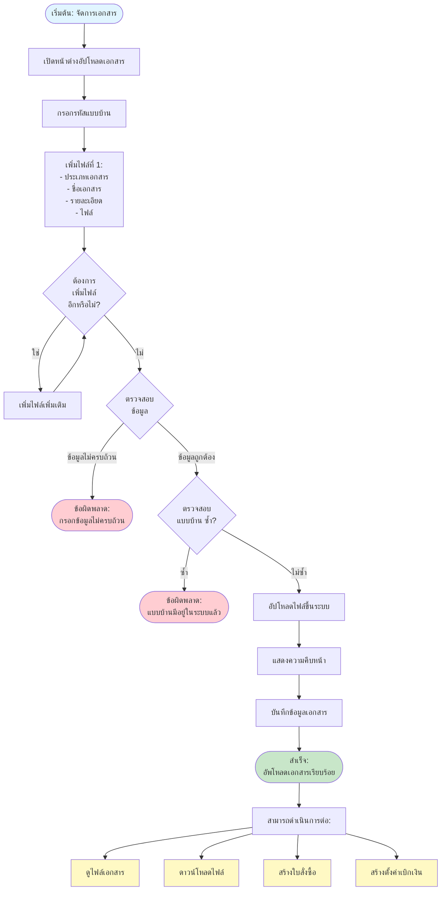
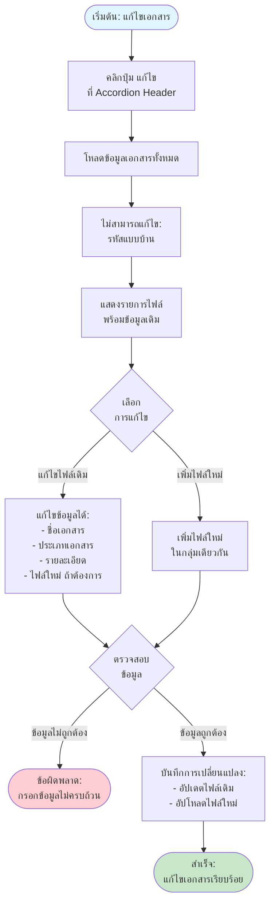
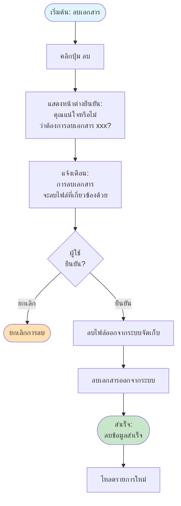

# Document Flow - การจัดการแบบบ้านและเอกสารต่างๆ

## Overview
การจัดการแบบบ้านและเอกสารต่างๆ เป็นการอัปโหลดและจัดการไฟล์เอกสารที่เกี่ยวข้องกับแบบบ้าน โดยสามารถอัปโหลดหลายไฟล์พร้อมกันได้ และระบบจะจัดกลุ่มเอกสารตามแบบบ้านเป็นหมวดหมู่ที่สามารถขยาย-ย่อได้

## Flowchart

## Process Steps

### 1. เปิดหน้าต่างอัปโหลดเอกสาร
- คลิกปุ่ม "อัปโหลดเอกสาร"
- ระบบจะเปิดหน้าต่างสำหรับอัปโหลด

### 2. กรอกรหัสแบบบ้าน
- **รหัสแบบบ้าน**: เช่น H001, PROJ-00001 (บังคับกรอก)
- ระบบจะใช้รหัสนี้ในการจัดกลุ่มเอกสาร
- **หมายเหตุ**: เมื่อสร้างแล้วจะไม่สามารถแก้ไขรหัสแบบบ้านได้

### 3. เพิ่มไฟล์
สำหรับแต่ละไฟล์ ต้องกรอกข้อมูล:

#### ข้อมูลที่ต้องกรอก:
- **ชื่อเอกสาร**: ชื่อของเอกสาร (บังคับกรอก)
  - ถ้าไม่กรอก ระบบจะใช้ชื่อไฟล์อัตโนมัติ (ตัดนามสกุลออก)
- **ประเภทเอกสาร**: เลือกประเภท (บังคับกรอก)
  - เช่น: แบบบ้าน, เอกสารประกอบ, ใบรับรอง, ฯลฯ
- **รายละเอียด**: รายละเอียดเพิ่มเติม (ไม่บังคับ)
- **ไฟล์เอกสาร**: อัปโหลดไฟล์ (บังคับกรอกเมื่อสร้างใหม่)
  - รองรับไฟล์: PDF, JPG, JPEG, PNG, DOC, DOCX
  - ขนาดสูงสุด: 50MB ต่อไฟล์

#### การเพิ่มไฟล์เพิ่มเติม:
- คลิกปุ่ม "เพิ่มไฟล์"
- สามารถเพิ่มได้ไม่จำกัด
- แต่ละไฟล์จะแสดงเป็นการ์ดแยกต่างหาก
- สามารถลบไฟล์ที่ไม่ต้องการออกได้ (ถ้ามีมากกว่า 1 ไฟล์)

### 4. ตรวจสอบข้อมูล
ระบบจะตรวจสอบ:
- รหัสแบบบ้านต้องกรอก
- แต่ละไฟล์ต้องกรอกข้อมูลครบ:
  - ต้องเลือกประเภทเอกสาร
  - ต้องกรอกชื่อเอกสาร
  - ต้องเลือกไฟล์ (เมื่อสร้างใหม่)

### 5. ตรวจสอบรหัสแบบบ้านซ้ำ
- **เมื่อสร้างใหม่**: ระบบจะตรวจสอบว่ารหัสแบบบ้านซ้ำหรือไม่
- ถ้าซ้ำ: แสดงข้อความ "แบบบ้าน xxx มีอยู่ในระบบแล้ว"
- เลื่อนไปที่ช่องรหัสแบบบ้านและเน้นช่องกรอกอัตโนมัติ

### 6. อัปโหลดไฟล์
- ระบบจะอัปโหลดหลายไฟล์พร้อมกัน
- แสดงความคืบหน้า (0-100%)
- ไฟล์จะถูกอัปโหลดขึ้นระบบจัดเก็บ
- ได้รับลิงก์ไฟล์กลับมา

### 7. บันทึกเอกสาร
- บันทึกข้อมูลเอกสารทุกไฟล์ลงระบบ
- เก็บข้อมูล:
  - ประเภทตาราง
  - รหัสแบบบ้าน
  - ประเภทเอกสาร
  - ชื่อเอกสาร
  - รายละเอียด
  - ข้อมูลไฟล์ (ลิงก์, ชื่อไฟล์, ขนาด, ประเภท)
- บันทึกว่าใครเป็นผู้สร้างและเมื่อไหร่

### 8. การใช้งานหลังอัปโหลดสำเร็จ
หลังจากอัปโหลดเอกสารเรียบร้อยแล้ว สามารถดำเนินการต่อได้:

#### A. ดูไฟล์
- คลิกปุ่ม "ดู"
- เปิดไฟล์ในแท็บใหม่

#### B. ดาวน์โหลดไฟล์
- คลิกปุ่ม "ดาวน์โหลด"
- ดาวน์โหลดไฟล์ลงเครื่อง

#### C. สร้างใบสั่งซื้อ
- ใช้รหัสแบบบ้านในการอ้างอิง
- ดูรายละเอียดใน [PO Flow](11_PO_FLOW.md)

#### D. สร้างการตั้งค่าเบิกเงิน
- ใช้รหัสแบบบ้านในการตั้งค่า
- ดูรายละเอียดใน [Setting Subcontractor Flow](03_SETTING_SUBCONTRACTOR_FLOW.md)

## Edit Document Flow

## การจัดกลุ่มเอกสาร

### การจัดกลุ่มเอกสาร
- เอกสารจะถูกจัดกลุ่มตามรหัสแบบบ้าน
- แสดงเป็นหมวดหมู่ที่สามารถขยาย-ย่อได้
- หัวข้อหมวดหมู่แสดง:
  - รหัสแบบบ้าน
  - จำนวนไฟล์
  - วันที่สร้าง
  - ปุ่มแก้ไข

### การแสดงรายการในกลุ่ม
- เรียงลำดับตามชื่อเอกสาร จาก A-Z
- แสดงรายละเอียดแต่ละไฟล์:
  - ประเภทเอกสาร (ป้ายสี)
  - ชื่อเอกสาร
  - ชื่อไฟล์และขนาด
  - วันที่สร้าง
  - ปุ่มจัดการ (ดู/ดาวน์โหลด/ลบ)

## Delete Document Flow

## การค้นหาและกรองข้อมูล

### การค้นหา
- ค้นหาจาก: รหัสแบบบ้าน, ชื่อเอกสาร
- แสดงผลทันทีเมื่อพิมพ์

### การกรองตามประเภทเอกสาร
- เลือก "ทุกประเภท" หรือประเภทที่ต้องการ
- ตัวเลือกมาจากประเภทเอกสารที่กำหนดไว้

### การแสดงผล
- แสดงเป็นหมวดหมู่ที่สามารถขยาย-ย่อได้
- แต่ละกลุ่มแสดง:
  - หัวข้อ: รหัสแบบบ้าน, จำนวนไฟล์, วันที่สร้าง
  - เนื้อหา: รายละเอียดเอกสารแต่ละไฟล์

### การแสดงผลบนอุปกรณ์ต่างๆ
- **คอมพิวเตอร์**: แสดงเต็มรูปแบบ
- **มือถือ**: ปรับรูปแบบให้แสดงแบบกะทัดรัด

## การจัดการข้อผิดพลาด

### ข้อผิดพลาดที่อาจเกิดขึ้น:

1. **ไม่ได้กรอกรหัสแบบบ้าน**
   - **ข้อความ**: "กรุณากรอกข้อมูลให้ครบถ้วน"
   - **การแก้ไข**: กรอกรหัสแบบบ้านให้ครบถ้วน

2. **รหัสแบบบ้านซ้ำ (เมื่อสร้างใหม่)**
   - **ข้อความ**: "แบบบ้าน [xxx] มีอยู่ในระบบแล้ว"
   - **การแก้ไข**: เปลี่ยนรหัสแบบบ้านเป็นรหัสใหม่ที่ยังไม่มีในระบบ

3. **ไม่ได้เลือกประเภทเอกสาร**
   - **ข้อความ**: "กรุณาเลือกประเภทเอกสาร"
   - **การแก้ไข**: เลือกประเภทเอกสารจากรายการ

4. **ไม่ได้กรอกชื่อเอกสาร**
   - **ข้อความ**: "กรุณาระบุชื่อเอกสาร"
   - **การแก้ไข**: กรอกชื่อเอกสารให้ครบถ้วน

5. **ไม่ได้เลือกไฟล์ (เมื่อสร้างใหม่)**
   - **ข้อความ**: "กรุณาเลือกไฟล์"
   - **การแก้ไข**: เลือกไฟล์ที่ต้องการอัปโหลด

6. **ไฟล์ขนาดใหญ่เกินไป**
   - **ข้อความ**: "ขนาดไฟล์ต้องไม่เกิน 50MB ต่อไฟล์"
   - **การแก้ไข**: เลือกไฟล์ที่มีขนาดเล็กกว่า 50MB

7. **รูปแบบไฟล์ไม่ถูกต้อง**
   - **ข้อความ**: "กรุณาอัปโหลดไฟล์ประเภท PDF, JPG, PNG, DOC, DOCX เท่านั้น"
   - **การแก้ไข**: เลือกไฟล์ที่เป็นประเภท PDF, JPG, PNG, DOC หรือ DOCX

8. **ระยะเวลาใช้งานหมดอายุ**
   - **ข้อความ**: "ระยะเวลาใช้งานหมดอายุ กรุณาเข้าสู่ระบบใหม่"
   - **การแก้ไข**: เข้าสู่ระบบใหม่อีกครั้ง

9. **ไม่สามารถอัปโหลดได้**
   - **ข้อความ**: "เกิดข้อผิดพลาดในการอัปโหลด"
   - **การแก้ไข**: ตรวจสอบการเชื่อมต่ออินเทอร์เน็ตหรือรีโหลดหน้าจอใหม่และลองอีกครั้ง

## ฟีเจอร์ที่เกี่ยวข้อง

- **การจัดการใบสั่งซื้อ** - ใช้รหัสแบบบ้านในการอ้างอิง
- **การตั้งค่าเบิกเงินผู้รับเหมา** - ใช้รหัสแบบบ้านในการตั้งค่า
- **ระบบจัดเก็บไฟล์** - จัดเก็บไฟล์ในระบบคลาวด์

---

**หมายเหตุ**: Flow chart นี้แสดงกระบวนการหลักในการจัดการแบบบ้านและเอกสารต่างๆ หากต้องการรายละเอียดเพิ่มเติมของแต่ละขั้นตอน กรุณาดูเอกสารที่เกี่ยวข้อง
