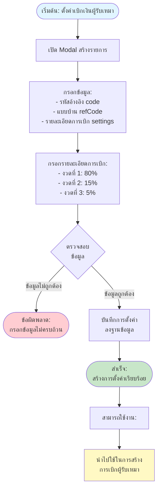

# Setting Subcontractor Flow - การตั้งค่าเบิกเงินผู้รับเหมา

## Overview
การตั้งค่าเบิกเงินผู้รับเหมา เป็นการกำหนดว่าจะจ่ายเงินให้ผู้รับเหมาแต่ละแบบบ้านเท่าไร แบ่งจ่ายกี่งวด งวดละเท่าไร โดยต้องตั้งค่านี้ก่อนจึงจะสามารถสร้างรายการเบิกเงินผู้รับเหมาได้

## Flowchart

## Process Steps

### 1. เปิด Modal สร้างรายการ (Open Modal)
- คลิกปุ่ม "เพิ่มรายการใหม่"
- ระบบจะเปิด Modal สำหรับกรอกข้อมูล

### 2. กรอกข้อมูลหลัก (Fill Form)
- **ข้อมูลที่ต้องกรอก**:
  - **รหัสอ้างอิง (code)**: รหัสสำหรับอ้างอิงการตั้งค่า
  - **แบบบ้าน (refCode)**: รหัสแบบบ้านที่ต้องการตั้งค่าการเบิก
  - **หมายเหตุ (description)**: รายละเอียดเพิ่มเติม (ถ้ามี)

### 3. กรอกรายละเอียดการเบิก (Fill Settings)
การตั้งค่าการเบิกเงินแบ่งเป็น 3 งวด ตามเปอร์เซ็นต์:

#### งวดที่ 1: 80% (80_percent)
- **ชื่อ (name)**: ชื่องวดการเบิก เช่น "งวดที่ 1"
- **จำนวนเงิน (amount)**: ระบุจำนวนเงินที่จะเบิกในงวดนี้
- **หมายเหตุ (note)**: รายละเอียดเพิ่มเติม (ถ้ามี)

#### งวดที่ 2: 15% (15_percent)
- **ชื่อ (name)**: ชื่องวดการเบิก เช่น "งวดที่ 2"
- **จำนวนเงิน (amount)**: ระบุจำนวนเงินที่จะเบิกในงวดนี้
- **หมายเหตุ (note)**: รายละเอียดเพิ่มเติม (ถ้ามี)

#### งวดที่ 3: 5% (5_percent)
- **ชื่อ (name)**: ชื่องวดการเบิก เช่น "งวดที่ 3"
- **จำนวนเงิน (amount)**: ระบุจำนวนเงินที่จะเบิกในงวดนี้
- **หมายเหตุ (note)**: รายละเอียดเพิ่มเติม (ถ้ามี)

### 4. ตรวจสอบข้อมูล (Validate Form)
- ตรวจสอบความครบถ้วนของข้อมูล
- ตรวจสอบรหัสอ้างอิงไม่ซ้ำ
- ตรวจสอบแบบบ้านระบุแล้ว
- ตรวจสอบรายละเอียดการเบิกครบทั้ง 3 งวด
- ตรวจสอบจำนวนเงินเป็นตัวเลขที่ถูกต้อง

### 5. บันทึกการตั้งค่า (Save Setting)
- บันทึกข้อมูลลงฐานข้อมูล MongoDB
- คำนวณยอดรวม (totalAmount) จากผลรวมของ settings ทั้ง 3 งวด
- บันทึก createdBy และ createdAt

### 6. การใช้งานหลังสร้างการตั้งค่าสำเร็จ
หลังจากสร้างการตั้งค่าเรียบร้อยแล้ว:

#### นำไปใช้ในการเบิกผู้รับเหมา (Use in Subcontractor)
- เมื่อสร้างการเบิกผู้รับเหมา ระบบจะดึงการตั้งค่าตาม refCode
- ใช้จำนวนเงินจาก settings ในการคำนวณการเบิกแต่ละงวด
- ดูรายละเอียดใน [Subcontractor Flow](14_SUBCONTRACTOR_FLOW.md)

## ตัวอย่างการตั้งค่า

### ตัวอย่างการตั้งค่าเบิกเงิน:

สมมติแบบบ้าน "H001" มีค่าติดตั้งทั้งหมด 100,000 บาท

**งวดที่ 1 (80%)**
- ชื่องวด: งวดที่ 1
- จำนวนเงิน: 80,000 บาท
- หมายเหตุ: เบิกหลังติดตั้งเสร็จ

**งวดที่ 2 (15%)**
- ชื่องวด: งวดที่ 2
- จำนวนเงิน: 15,000 บาท
- หมายเหตุ: เบิกหลังตรวจรับ

**งวดที่ 3 (5%)**
- ชื่องวด: งวดที่ 3
- จำนวนเงิน: 5,000 บาท
- หมายเหตุ: เบิกหลังผ่าน QC

**ยอดรวมทั้งหมด: 100,000 บาท** (80,000 + 15,000 + 5,000)

## View/Edit/Delete Operations

### การดูรายละเอียด (View)
- คลิกปุ่ม "ดู" (eye icon)
- แสดงข้อมูลทั้งหมดใน Modal:
  - รหัสอ้างอิง
  - แบบบ้าน
  - ยอดเบิกรวม
  - รายละเอียดการเบิกแต่ละงวด (ตาราง)
  - ข้อมูลการสร้าง/แก้ไข

### การแก้ไข (Edit)
- คลิกปุ่ม "แก้ไข" (pencil icon) หรือคลิกจาก View Modal
- เปิด Modal แก้ไข พร้อมข้อมูลเดิม
- สามารถแก้ไข:
  - รายละเอียดการเบิก (settings)
  - หมายเหตุ (description)
- **ไม่สามารถแก้ไข**: รหัสอ้างอิง (code), แบบบ้าน (refCode)
- บันทึก updatedBy และ updatedAt

### การลบ (Delete)
- คลิกปุ่ม "ลบ" (trash icon)
- แสดง Confirmation Modal
- ยืนยันการลบ
- ลบข้อมูลออกจากฐานข้อมูล

## Search and Filter

### การค้นหา (Search)
- ค้นหาจาก: รหัสอ้างอิง (code), แบบบ้าน (refCode)
- ใช้ debounce 500ms เพื่อลด API calls

### การแสดงผลในตาราง
- แสดงคอลัมน์:
  - รหัสอ้างอิง (code)
  - แบบบ้าน (refCode) - badge
  - รายละเอียดการเบิก (settings) - breakdown แต่ละงวด
  - ยอดรวม (totalAmount) - จัดชิดขวา
  - จัดการ (actions) - ดู/แก้ไข/ลบ

## การจัดการข้อผิดพลาด

### ข้อผิดพลาดที่อาจเกิดขึ้น:

1. **ข้อมูลไม่ครบถ้วน**
   - **ข้อความ**: "กรุณากรอกข้อมูลให้ครบถ้วน"
   - **การแก้ไข**: กรอกข้อมูลที่จำเป็นให้ครบถ้วน

2. **รหัสอ้างอิงซ้ำ**
   - **ข้อความ**: "รหัสอ้างอิงนี้มีอยู่ในระบบแล้ว"
   - **การแก้ไข**: เปลี่ยนรหัสอ้างอิงเป็นรหัสใหม่ที่ยังไม่มีในระบบ

3. **แบบบ้านไม่ถูกต้อง**
   - **ข้อความ**: "กรุณาระบุแบบบ้าน"
   - **การแก้ไข**: เลือกแบบบ้านจากรายการ

4. **จำนวนเงินไม่ถูกต้อง**
   - **ข้อความ**: "กรุณาระบุจำนวนเงินเป็นตัวเลข"
   - **การแก้ไข**: กรอกจำนวนเงินเป็นตัวเลขที่ถูกต้อง

5. **ไม่สามารถบันทึกได้**
   - **ข้อความ**: "ไม่สามารถบันทึกการตั้งค่าได้ กรุณาลองใหม่อีกครั้ง"
   - **การแก้ไข**: ตรวจสอบข้อมูลที่กรอกหรือรีโหลดหน้าจอใหม่และลองอีกครั้ง

## Related Features

- **Document Management** - จัดการแบบบ้าน (refCode ที่ใช้ในการตั้งค่า)
- **Subcontractor Management** - การเบิกผู้รับเหมา (ใช้การตั้งค่านี้ในการคำนวณ)

---

**หมายเหตุ**: Flow chart นี้แสดงกระบวนการหลักในการตั้งค่าเบิกเงินผู้รับเหมา หากต้องการรายละเอียดเพิ่มเติมของแต่ละขั้นตอน กรุณาดูเอกสารที่เกี่ยวข้อง
