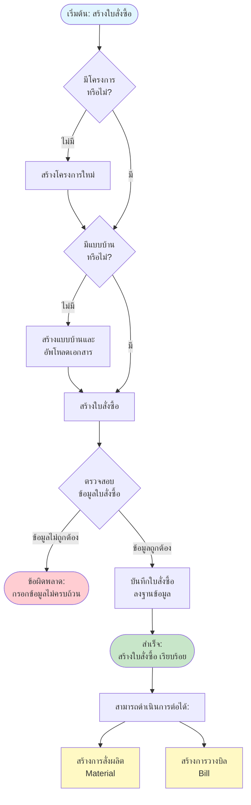

# Purchase Order (PO) Flow - การสร้างใบสั่งซื้อ

## Overview
การสร้างใบสั่งซื้อ (PO) เป็นจุดเริ่มต้นของกระบวนการจัดการโครงการ โดยต้องมีโครงการและแบบบ้านก่อนจึงจะสามารถสร้าง PO ได้

## Flowchart

## Process Steps

### 1. ตรวจสอบโครงการ (Check Project)
- **เงื่อนไข**: ต้องมีโครงการที่เกี่ยวข้องกับ PO
- **กรณีไม่มีโครงการ**:
  - ไปที่หน้า "จัดการโครงการ" (Project Management)
  - สร้างโครงการใหม่โดยระบุข้อมูล:
    - ชื่อโครงการ
    - โซน/ภูมิภาค
    - จังหวัด
    - ข้อมูลอื่นๆ ที่จำเป็น

### 2. ตรวจสอบแบบบ้าน (Check Document)
- **เงื่อนไข**: ต้องมีแบบบ้านและเอกสารที่เกี่ยวข้อง
- **กรณีไม่มีแบบบ้าน**:
  - ไปที่หน้า "จัดการเอกสาร" (Document Management)
  - สร้างแบบบ้านใหม่และอัพโหลดไฟล์:
    - แบบบ้าน (House Plan)
    - เอกสารตรวจสอบ (Verification Documents)
    - เอกสารอื่นๆ ที่จำเป็น

### 3. สร้างใบสั่งซื้อ (Create Purchase Order)
- **ข้อมูลที่ต้องกรอก**:
  - เลือกโครงการ
  - เลือกแบบบ้าน
  - แปลง/บ้านเลขที่
  - วันที่ส่งของ
  - รายละเอียดใบสั่งซื้อ เลขที่ใบสั่งซื้อ, วันที่ออกใบสั่งซื้อ, จำนวนเงิน (บาท) ตามหัวข้อ ดังนี้ ค่าของ 40%, ค่าของ 60%, ค่าแรง, ค่ามุ้ง
  - หมายเหตุ (ถ้ามี)

### 4. บันทึกใบสั่งซื้อ
- ระบบจะตรวจสอบความถูกต้องของข้อมูล
- บันทึกลงฐานข้อมูล MongoDB
- สร้างเลขที่ใบสั่งซื้อ อัตโนมัติ

### 5. ขั้นตอนต่อไปหลังสร้างใบสั่งซื้อ สำเร็จ
หลังจากสร้างใบสั่งซื้อ สำเร็จแล้ว สามารถดำเนินการต่อได้ 2 ทาง:

#### A. สร้างการสั่งผลิต (Material)
- เลือกใบสั่งซื้อ ที่สร้างไว้
- สร้างรายการสั่งผลิต
- ดูรายละเอียดใน [Material Flow](12_MATERIAL_FLOW.md)

#### B. สร้างการวางบิล (Bill)
- เลือกใบสั่งซื้อ ที่สร้างไว้
- สร้างรายการวางบิล
- ดูรายละเอียดใน [Bill Flow](15_BILL_FLOW.md)

## Error Handling

### ข้อผิดพลาดที่อาจเกิดขึ้น:

1. **ไม่มีโครงการ**
   - **Message**: กรุณาสร้างโครงการก่อนสร้างใบสั่งซื้อ
   - **Action**: ไปหน้าสร้างโครงการ

2. **ไม่มีแบบบ้าน**
   - **Message**: กรุณาสร้างแบบบ้านและอัพโหลดเอกสารก่อนสร้างใบสั่งซื้อ
   - **Action**: ไปหน้าจัดการเอกสาร

3. **ข้อมูลใบสั่งซื้อ ไม่ครบถ้วน**
   - **Message**: กรุณากรอกข้อมูลให้ครบถ้วน
   - **Action**: แสดงข้อความแจ้งเตือน

4. **ข้อผิดพลาดในการบันทึก**
   - **Message**: ไม่สามารถบันทึกใบสั่งซื้อ ได้ กรุณาลองใหม่อีกครั้ง
   - **Action**: แสดงข้อความแจ้งเตือน

## Related Features

- **Project Management** - จัดการโครงการ
- **Document Management** - จัดการเอกสารและแบบบ้าน
- **Material Management** - การสั่งผลิต (ขั้นตอนถัดไป)
- **Bill Management** - การวางบิล (ขั้นตอนถัดไป)

---

**หมายเหตุ**: Flow chart นี้แสดงกระบวนการหลักในการสร้าง PO หากต้องการรายละเอียดเพิ่มเติมของแต่ละขั้นตอน กรุณาดูเอกสารที่เกี่ยวข้อง
