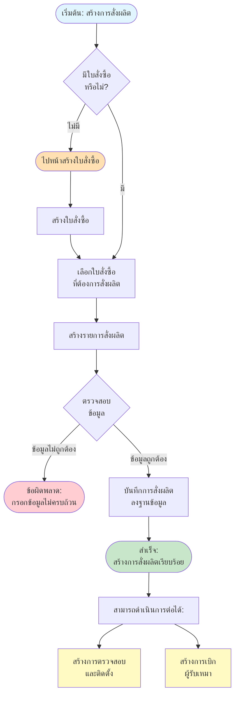
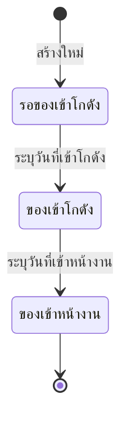

# Material Flow - การสร้างการสั่งผลิต

## Overview
การสร้างการสั่งผลิต (Material) เป็นขั้นตอนที่ 2 หลังจากสร้างใบสั่งซื้อ แล้ว โดยต้องมีใบสั่งซื้อ ก่อนจึงจะสามารถสร้างการสั่งผลิตได้

## Flowchart

## Process Steps

### 1. ตรวจสอบใบสั่งซื้อ (Check PO)
- **เงื่อนไข**: ต้องมีใบสั่งซื้อ ที่สร้างไว้แล้ว
- **กรณีไม่มีใบสั่งซื้อ**:
  - ไปหน้า "จัดการใบสั่งซื้อ"
  - สร้างใบสั่งซื้อ ตามขั้นตอนใน [PO Flow](01_PO_FLOW.md)
  - กลับมาสร้างการสั่งผลิตหลังจากสร้างใบสั่งซื้อ สำเร็จ

### 2. เลือกใบสั่งซื้อ (Select PO)
- แสดงรายการใบสั่งซื้อ ที่สามารถสั่งผลิตได้
- เลือกใบสั่งซื้อ ที่ต้องการสร้างการสั่งผลิต
- ระบบจะดึงข้อมูลจากใบสั่งซื้อ มาแสดง:
  - เลขที่ใบสั่งซื้อ
  - แบบบ้าน
  - แปลง/บ้านเลขที่
  - วันที่ออกใบสั่งซื้อ
  - วันที่ส่งของ
  - ภาค
  - จังหวัด
  - โครงการ

### 3. สร้างรายการสั่งผลิต (Create Material)
- **ข้อมูลที่ต้องกรอก**:
  - **รายการใบสั่งซื้อ**: เลือกจากใบสั่งซื้อ หรือเพิ่มใหม่
  - **วันที่สั่งผลิต**: ระบุจำนวนที่ต้องการสั่งผลิต
  - **วันที่เข้าโกดัง**: ระบุเมื่อของเข้าโกดังแล้ว
  - **วันที่เข้าหน้างาน**: ระบุเมื่อผู้รับเหมามารับของจากโกดัง
  - **ชื่อผู้รับเหมาติดตั้ง**: ระบุชื่อผู้รับเหมาที่เข้ามารับของจากโกดัง
  - **หมายเหตุ**: ข้อมูลเพิ่มเติม (ถ้ามี)

### 4. ตรวจสอบข้อมูล (Validate Material)
- ตรวจสอบความครบถ้วนของข้อมูล
- ตรวจสอบระบุจำนวนที่ต้องการสั่งผลิต

### 5. บันทึกการสั่งผลิต (Save Material)
- บันทึกข้อมูลลงฐานข้อมูล
- สร้างเลขที่การสั่งผลิตอัตโนมัติ

### 6. ขั้นตอนต่อไปหลังสร้างการสั่งผลิตสำเร็จ
หลังจากสร้างการสั่งผลิตสำเร็จแล้ว สามารถดำเนินการต่อได้ 2 ทาง:

#### A. สร้างการตรวจสอบและติดตั้ง (Installment)
- เลือกการสั่งผลิตที่สร้างไว้
- สร้างรายการตรวจสอบและติดตั้ง
- ดูรายละเอียดใน [Installment Flow](13_INSTALLMENT_FLOW.md)

#### B. สร้างการเบิกผู้รับเหมา (Subcontractor)
- เลือกการสั่งผลิตที่สร้างไว้
- สร้างรายการเบิกเงินผู้รับเหมา
- ดูรายละเอียดใน [Subcontractor Flow](14_SUBCONTRACTOR_FLOW.md)

## Material Status Flow

## Error Handling

### ข้อผิดพลาดที่อาจเกิดขึ้น:

1. **ไม่มีใบสั่งซื้อ**
   - **Message**: กรุณาสร้างใบสั่งซื้อ ก่อนสร้างการสั่งผลิต
   - **Action**: ไปหน้าจัดการใบสั่งซื้อ และสร้างใบสั่งซื้อตามขั้นตอนใน [PO Flow](01_PO_FLOW.md)
   
2. **วันที่ไม่ถูกต้อง**
   - **Message**: รูปแบบวันที่และเงื่อนไขต้องถูกต้อง
   - **Action**: แสดงข้อความแจ้งเตือน

3. **ข้อมูลไม่ครบถ้วน**
   - **Message**: กรุณากรอกข้อมูลให้ครบถ้วน
   - **Action**: แสดงข้อความแจ้งเตือน

4. **ข้อผิดพลาดในการบันทึก**
   - **Message**: ไม่สามารถบันทึกการสั่งผลิตได้ กรุณาลองใหม่อีกครั้ง
   - **Action**: แสดงข้อความแจ้งเตือน

## Related Features

- **PO Management** - จัดการใบสั่งซื้อ (ขั้นตอนก่อนหน้า)
- **Installment Management** - การตรวจสอบและติดตั้ง (ขั้นตอนถัดไป)
- **Subcontractor Management** - การเบิกผู้รับเหมา (ขั้นตอนถัดไป)

---

**หมายเหตุ**: Flow chart นี้แสดงกระบวนการหลักในการสร้างการสั่งผลิต หากต้องการรายละเอียดเพิ่มเติมของแต่ละขั้นตอน กรุณาดูเอกสารที่เกี่ยวข้อง
