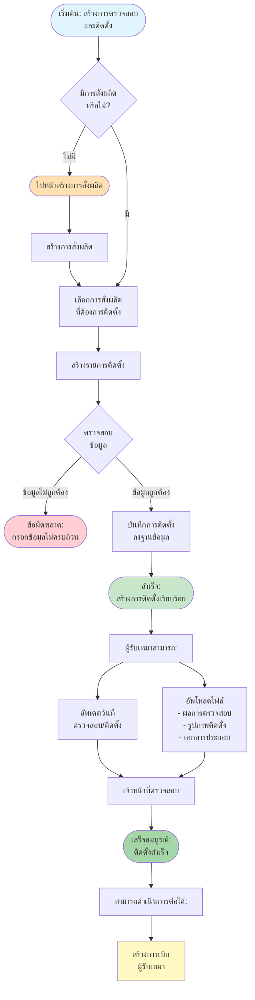
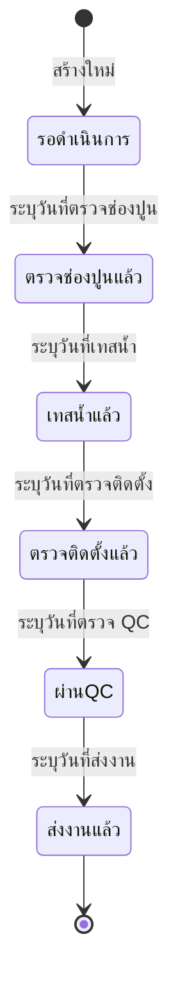

# Installment Flow - การสร้างการตรวจสอบและติดตั้ง

## Overview
การสร้างการตรวจสอบและติดตั้ง (Installment) เป็นขั้นตอนที่ 3 หลังจากสร้างการสั่งผลิต (Material) แล้ว โดยต้องมีการสั่งผลิตก่อนจึงจะสามารถสร้างการตรวจสอบและติดตั้งได้

## Flowchart

## Process Steps

### 1. ตรวจสอบการสั่งผลิต (Check Material)
- **เงื่อนไข**: ต้องมีการสั่งผลิตที่สร้างไว้แล้ว
- **กรณีไม่มีการสั่งผลิต**:
  - ไปหน้า "จัดการการสั่งผลิต"
  - สร้างการสั่งผลิตตามขั้นตอนใน [Material Flow](12_MATERIAL_FLOW.md)
  - กลับมาสร้างการติดตั้งหลังจากสร้างการสั่งผลิตสำเร็จ

### 2. สร้างรายการติดตั้ง (Create Installment)
- **ข้อมูลที่ต้องกรอก**:
  - **การสั่งผลิตที่เกี่ยวข้อง**: เลือกจากรายการที่พร้อมติดตั้ง
  - **วันที่ตรวจช่องปูน**: วันที่เข้าหน้างาน เพื่อตรวจช่องปูน
  - **วันที่เทสน้ำ**: วันที่เข้าหน้างาน เพื่อเทสน้ำ
  - **วันที่ตรวจติดตั้ง**: วันที่เริ่มตรวจติดตั้ง
  - **วันที่ตรวจ QC**: วันที่เข้าหน้างาน เพื่อตรวจ QC
  - **วันที่ส่งงาน**: วันที่ส่งงานเสร็จสิ้น
  - **หมายเหตุ**: ข้อมูลเพิ่มเติม (ถ้ามี)

### 3. ผู้รับเหมาดำเนินการ (Contractor Actions)

#### A. อัพเดตวันที่ (Update Date)
  - วันที่ตรวจช่องปูน
  - วันที่เทสน้ำ
  - วันที่ตรวจติดตั้ง
  - วันที่ตรวจ QC
  - วันที่ส่งงาน

#### B. อัพโหลดไฟล์ (Upload Files)
- **แบบฟอร์มการตรวจสอบ**:
  - ผลการตรวจช่องปูน
  - ผลการเทสน้ำ
  - ผลการตรวจติดตั้ง
  - ผลการตรวจ QC

- **รูปภาพหลังติดตั้ง**:
  - งานที่เสร็จสมบูรณ์

- **เอกสารประกอบ**:
  - ใบตรวจรับงาน
  - เอกสารรับประกัน

#### C. อัพเดตสถานะ (Update Status)

## Error Handling

### ข้อผิดพลาดที่อาจเกิดขึ้น:

1. **ไม่มีการสั่งผลิต**
   - **Message**: กรุณาสร้างการสั่งผลิตก่อนสร้างการติดตั้ง
   - **Action**: ไปหน้าจัดการการสั่งผลิต และสร้างการสั่งผลิตตามขั้นตอนใน [Material Flow](12_MATERIAL_FLOW.md)

2. **วันที่ไม่ถูกต้อง**
   - **Message**: วันที่นัดหมายต้องไม่เป็นอดีต
   - **Action**: แสดงข้อความแจ้งเตือน

3. **ไฟล์ขนาดใหญ่เกินไป**
   - **Message**: ขนาดไฟล์ต้องไม่เกิน 5MB ต่อไฟล์
   - **Action**: แสดงข้อความแจ้งเตือน

4. **รูปแบบไฟล์ไม่ถูกต้อง**
   - **Message**: กรุณาอัพโหลดไฟล์ประเภท JPG, PNG, PDF เท่านั้น
   - **Action**: แสดงข้อความแจ้งเตือน

## Related Features

- **Material Management** - การสั่งผลิต (ขั้นตอนก่อนหน้า)
- **Subcontractor Management** - การเบิกผู้รับเหมา (ขั้นตอนถัดไป)

---

**หมายเหตุ**: Flow chart นี้แสดงกระบวนการหลักในการสร้างและจัดการการติดตั้ง หากต้องการรายละเอียดเพิ่มเติมของแต่ละขั้นตอน กรุณาดูเอกสารที่เกี่ยวข้อง
