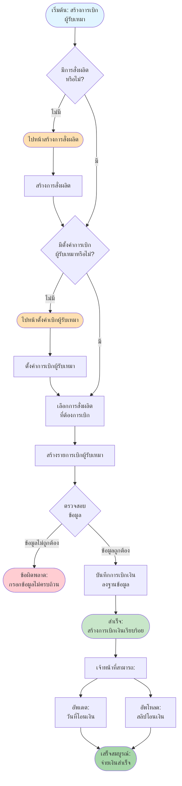
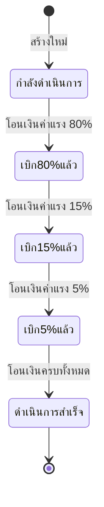

# Subcontractor Flow - การสร้างการเบิกผู้รับเหมา

## Overview
การสร้างการเบิกผู้รับเหมา (Subcontractor Payment) เป็นขั้นตอนการจ่ายเงินให้ผู้รับเหมาตามงานที่ทำ โดยต้องมีการสั่งผลิต (Material) และการตั้งค่าเบิกเงินผู้รับเหมา (Setting Subcontractor) ก่อนจึงจะสามารถสร้างการเบิกได้

## Flowchart

## Process Steps

### 1. ตรวจสอบการสั่งผลิต (Check Material)
- **เงื่อนไข**: ต้องมีการสั่งผลิตที่สร้างไว้แล้ว
- **กรณีไม่มีการสั่งผลิต**:
  - ไปหน้า "จัดการการสั่งผลิต"
  - สร้างการสั่งผลิตตามขั้นตอนใน [Material Flow](12_MATERIAL_FLOW.md)

### 2. ตรวจสอบการตั้งค่าเบิกเงิน (Check Setting Subcontractor)
- **เงื่อนไข**: ต้องมีการตั้งค่าเบิกเงินผู้รับเหมาก่อน
- **กรณีไม่มีการตั้งค่า**:
  - ไปหน้า "ตั้งค่าเบิกเงินผู้รับเหมา"
  - สร้างการตั้งค่าตามขั้นตอนใน [Setting Subcontractor Flow](03_SETTING_SUBCONTRACTOR_FLOW.md)

### 3. สร้างรายการเบิกเงิน (Create Subcontractor)
- **ข้อมูลที่ต้องกรอก**:
  - **การสั่งผลิตที่เกี่ยวข้อง**: อ้างอิงจากการสั่งผลิต
  - **วันที่โอน 80%**: ระบุเมื่อโอนเงินค่าแรง 80% ให้ผู้รับเหมา
  - **วันที่โอน 15%**: ระบุเมื่อโอนเงินค่าแรง 15% ให้ผู้รับเหมา
  - **วันที่โอน 5%**: ระบุเมื่อโอนเงินค่าแรง 5% ให้ผู้รับเหมา
  - **วันที่โอนค่ามุ้ง%**: ระบุเมื่อโอนเงินค่ามุ้ง
  - **วันที่โอนค่าทำความสะอาด%**: ระบุเมื่อโอนเงินค่าทำความสะอาด
  - **หมายเหตุ**: ข้อมูลเพิ่มเติม (ถ้ามี)

### 4. เจ้าหน้าที่ดำเนินการ (Staff Actions)

#### A. อัพเดตวันที่โอนเงิน (Update Transfer Date)
- ระบุวันที่ที่โอนเงินจริง

#### B. อัพโหลดสลิปโอนเงิน (Upload Slip)
- อัพโหลดรูปภาพสลิปโอนเงิน
- ระบบจะเก็บไฟล์ไว้

#### C. อัพเดตสถานะการจ่ายเงิน (Update Payment Status)

## Error Handling

### ข้อผิดพลาดที่อาจเกิดขึ้น:

1. **ไม่มีการสั่งผลิต**
   - **Message**: กรุณาสร้างการสั่งผลิตก่อนสร้างการเบิกเงิน
   - **Action**: ไปหน้าจัดการการสั่งผลิต และ สร้างการสั่งผลิตตามขั้นตอนใน [Material Flow](12_MATERIAL_FLOW.md)

2. **ไม่มีการตั้งค่าเบิกเงิน**
   - **Message**: กรุณาตั้งค่าเบิกเงินผู้รับเหมาก่อน
   - **Action**: ไปหน้าตั้งค่าเบิกเงิน และสร้างการตั้งค่าตามขั้นตอนใน [Setting Subcontractor Flow](03_SETTING_SUBCONTRACTOR_FLOW.md)

3. **วันที่ไม่ถูกต้อง**
   - **Message**: วันที่นัดหมายต้องไม่เป็นอดีต
   - **Action**: แสดงข้อความแจ้งเตือน

4. **ไฟล์สลิปไม่ถูกต้อง**
   - **Message**: กรุณาอัพโหลดไฟล์ประเภท JPG, PNG เท่านั้น
   - **Action**: แสดงข้อความแจ้งเตือน

## Related Features

- **Material Management** - การสั่งผลิต (ขั้นตอนก่อนหน้า)
- **Installment Management** - การตรวจสอบและติดตั้ง (ขั้นตอนก่อนหน้า)
- **Setting Subcontractor** - การตั้งค่าเบิกเงินผู้รับเหมา (จำเป็นต้องมี)

---

**หมายเหตุ**: Flow chart นี้แสดงกระบวนการหลักในการสร้างและจัดการการเบิกเงินผู้รับเหมา หากต้องการรายละเอียดเพิ่มเติมของแต่ละขั้นตอน กรุณาดูเอกสารที่เกี่ยวข้อง
