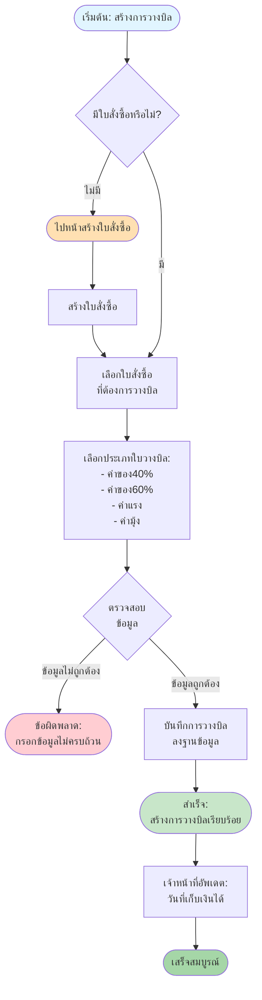
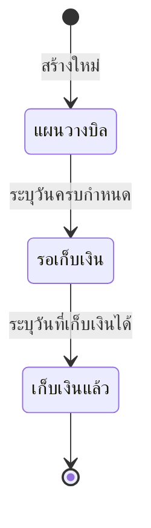

# Bill Flow - การสร้างการวางบิล

## Overview
การสร้างการวางบิล (Bill) เป็นขั้นตอนการเรียกเก็บเงินจากลูกค้าตามใบสั่งซื้อ (PO) โดยต้องมีใบสั่งซื้อ ก่อนจึงจะสามารถสร้างการวางบิลได้

## Flowchart

## Process Steps

### 1. ตรวจสอบใบสั่งซื้อ (Check PO)
- **เงื่อนไข**: ต้องมีใบสั่งซื้อ ที่สร้างไว้แล้ว
- **กรณีไม่มีใบสั่งซื้อ**:
  - ไปหน้า "จัดการใบสั่งซื้อ"
  - สร้างใบสั่งซื้อ ตามขั้นตอนใน [PO Flow](01_PO_FLOW.md)
  - กลับมาสร้างการวางบิลหลังจากสร้างใบสั่งซื้อ สำเร็จ

### 3. สร้างรายการเบิกเงิน (Create Bill)
- **ข้อมูลที่ต้องกรอก**:
  - **การสั่งผลิตที่เกี่ยวข้อง**: อ้างอิงจากการสั่งผลิต
  - **วันที่โอน 80%**: ระบุเมื่อโอนเงินค่าแรง 80% ให้ผู้รับเหมา
  - **วันที่โอน 15%**: ระบุเมื่อโอนเงินค่าแรง 15% ให้ผู้รับเหมา
  - **วันที่โอน 5%**: ระบุเมื่อโอนเงินค่าแรง 5% ให้ผู้รับเหมา
  - **วันที่โอนค่ามุ้ง%**: ระบุเมื่อโอนเงินค่ามุ้ง
  - **วันที่โอนค่าทำความสะอาด%**: ระบุเมื่อโอนเงินค่าทำความสะอาด
  - **หมายเหตุ**: ข้อมูลเพิ่มเติม (ถ้ามี)

### 6. เจ้าหน้าที่ดำเนินการ (Staff Actions)

#### A. อัพเดตวันที่เก็บเงิน (Update Collection Date)
- บันทึกวันที่รับเงิน

#### B. อัพโหลดสลิปโอนเงิน (Upload Slip)
- อัพโหลดรูปภาพสลิปโอนเงิน
- ระบบจะเก็บไฟล์ไว้

#### C. อัพเดตสถานะการชำระ (Update Payment Status)

## Error Handling

### ข้อผิดพลาดที่อาจเกิดขึ้น:

1. **ไม่มีใบสั่งซื้อ**
   - **Message**: กรุณาสร้างใบสั่งซื้อ ก่อนสร้างการสั่งผลิต
   - **Action**: ไปหน้าจัดการใบสั่งซื้อ และสร้างใบสั่งซื้อตามขั้นตอนใน [PO Flow](01_PO_FLOW.md)
   
2. **วันที่ไม่ถูกต้อง**
   - **Message**: รูปแบบวันที่และเงื่อนไขต้องถูกต้อง
   - **Action**: แสดงข้อความแจ้งเตือน

3. **ข้อมูลไม่ครบถ้วน**
   - **Message**: กรุณากรอกข้อมูลให้ครบถ้วน
   - **Action**: แสดงข้อความแจ้งเตือน

4. **ข้อผิดพลาดในการบันทึก**
   - **Message**: ไม่สามารถบันทึกการสั่งผลิตได้ กรุณาลองใหม่อีกครั้ง
   - **Action**: แสดงข้อความแจ้งเตือน

## Related Features

- **PO Management** - จัดการใบสั่งซื้อ (ขั้นตอนก่อนหน้า)

---

**หมายเหตุ**: Flow chart นี้แสดงกระบวนการหลักในการสร้างและจัดการการวางบิล หากต้องการรายละเอียดเพิ่มเติมของแต่ละขั้นตอน กรุณาดูเอกสารที่เกี่ยวข้อง
