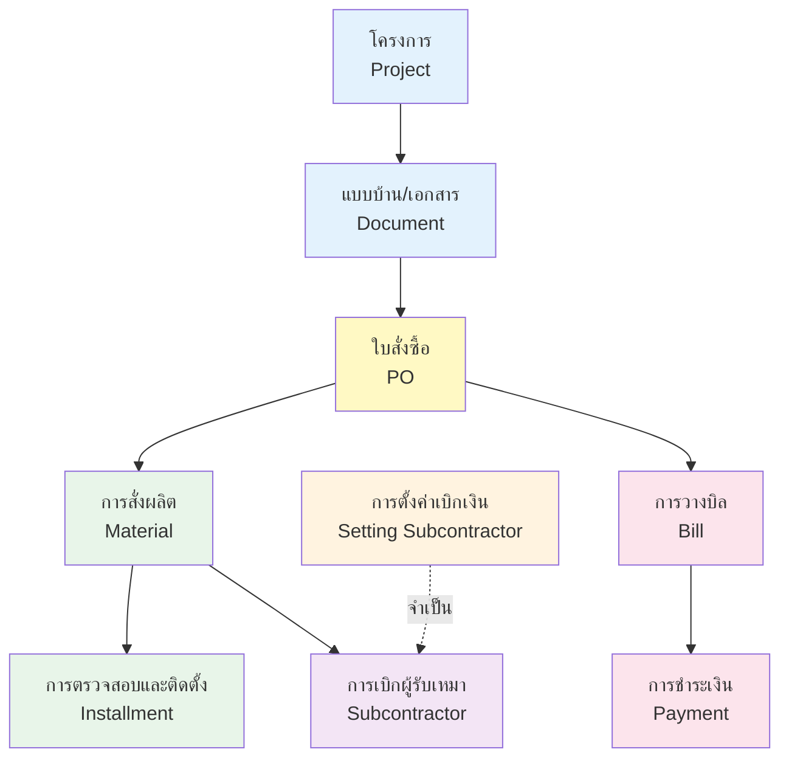
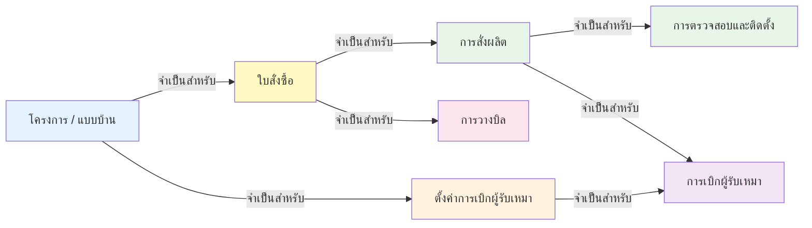
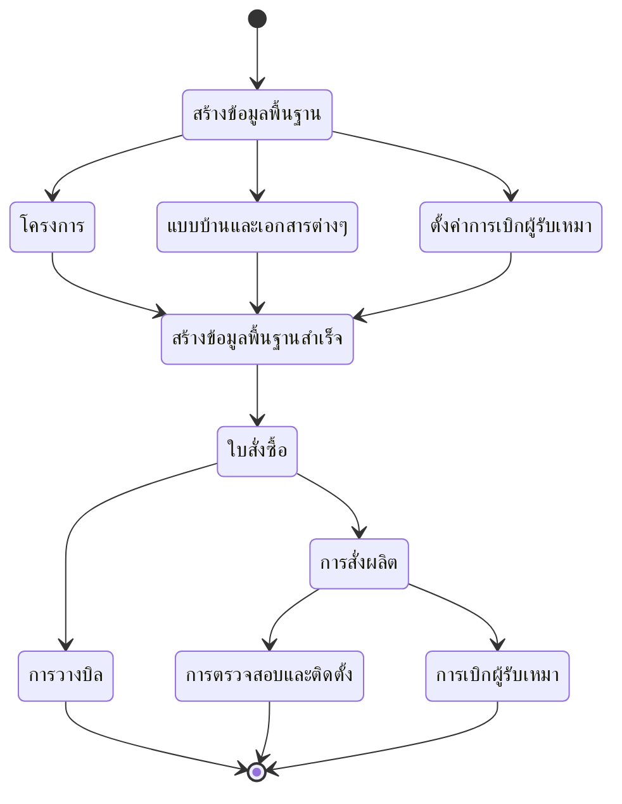

# QUS System Flowcharts - เอกสาร Flow Chart ระบบ QUS

## Overview

เอกสารชุดนี้แสดง Flow Chart ของระบบจัดการ Queue U S (QUS) ที่ครอบคลุมทุกขั้นตอนการทำงานตั้งแต่การสร้างใบสั่งซื้อ ไปจนถึงการเบิกเงินผู้รับเหมาและการวางบิล

## ลำดับการทำงานของระบบ



## รายการเอกสาร Flow Chart

### Core Features (ตามลำดับการทำงาน)

| ลำดับ | ชื่อเอกสาร | Feature | คำอธิบาย |
|-------|-----------|---------|----------|
| 1 | [PO Flow](11_PO_FLOW.md) | Purchase Order | การสร้างใบสั่งซื้อ (จุดเริ่มต้น) |
| 2 | [Material Flow](12_MATERIAL_FLOW.md) | Material | การสร้างการสั่งผลิต |
| 3 | [Installment Flow](13_INSTALLMENT_FLOW.md) | Installment | การสร้างการตรวจสอบและติดตั้ง |
| 4 | [Subcontractor Flow](14_SUBCONTRACTOR_FLOW.md) | Subcontractor | การสร้างการเบิกผู้รับเหมา |
| 5 | [Bill Flow](15_BILL_FLOW.md) | Bill | การสร้างการวางบิล |

### Additional Features
| ลำดับ | ชื่อเอกสาร | Feature | คำอธิบาย |
|-------|-----------|---------|----------|
| 1 | [Project Flow](01_PROJECT_FLOW.md) | Project Management | การจัดการโครงการ (ต้องมีก่อนสร้าง ใบสั่งซื้อ) |
| 2 | [Document Flow](02_DOCUMENT_FLOW.md) | Document Management | การจัดการแบบบ้านและเอกสาร (ต้องมีก่อนสร้าง ใบสั่งซื้อ) |
| 3 | [Setting Subcontractor Flow](03_SETTING_SUBCONTRACTOR_FLOW.md) | Setting Subcontractor | การตั้งค่าการเบิกผู้รับเหมา (จำเป็นก่อนการเบิกผู้รับเหมา) |

## ความสัมพันธ์ระหว่าง Features

### Dependencies (ความต้องการ)

```
──────────────────────────────
ข้อมูลพื้นฐาน 
──────────────────────────────
โครงการ
├── จำเป็นต้องมี: ภาค จังหวัด
└── ใช้สำหรับ: ใบสั่งซื้อ

แบบบ้านและเอกสาร
├── ใช้สำหรับ: ตั้งค่าการเบิกผู้รับเหมา
└── ใช้สำหรับ: ใบสั่งซื้อ

ตั้งค่าการเบิกผู้รับเหมา
├── จำเป็นต้องมี: แบบบ้านและเอกสาร
└── ใช้สำหรับ: การเบิกผู้รับเหมา

──────────────────────────────
ข้อมูลระบบ QUS 
──────────────────────────────
ใบสั่งซื้อ
├── จำเป็นต้องมี: โครงการ
├── จำเป็นต้องมี: แบบบ้านและเอกสาร
├── ใช้สำหรับ: การสั่งผลิต
└── ใช้สำหรับ: การวางบิล

การสั่งผลิต
├── จำเป็นต้องมี: ใบสั่งซื้อ
├── ใช้สำหรับ: การตรวจสอบและติดตั้ง
└── ใช้สำหรับ: การเบิกผู้รับเหมา

การตรวจสอบและติดตั้ง
└── จำเป็นต้องมี: การสั่งผลิต

การเบิกผู้รับเหมา
├── จำเป็นต้องมี: การสั่งผลิต
└── จำเป็นต้องมี: ตั้งค่าการเบิกผู้รับเหมา

การวางบิล
└── จำเป็นต้องมี: ใบสั่งซื้อ
```

### Data Flow (การไหลของข้อมูล)



## การใช้งานเอกสาร

### สำหรับ Developer
1. ศึกษา Flow Chart เพื่อเข้าใจกระบวนการทำงาน
2. ใช้เป็นแนวทางในการพัฒนา Feature
3. ตรวจสอบ Dependencies ก่อนเริ่มพัฒนา
4. ใช้เป็น Reference ในการเขียน API และ Database Schema

### สำหรับ Tester
1. ใช้เป็นแนวทางในการเขียน Test Case
2. ตรวจสอบ Error Handling ตาม Flow
3. ทดสอบ Integration ระหว่าง Features
4. ตรวจสอบ Validation และ Business Logic

### สำหรับ Product Owner / Business Analyst
1. เข้าใจกระบวนการทำงานของระบบ
2. วางแผนการพัฒนา Feature ใหม่
3. ตรวจสอบความสอดคล้องกับ Requirements
4. อธิบายระบบให้ Stakeholders

## Quick Start Guide

### ลำดับการทำงาน (แนะนำ)



## สถานะและการเปลี่ยนแปลง

### สถานะของแต่ละ Feature

#### ใบสั่งซื้อ (Purchase Order)
- `Approved` - อนุมัติ

#### การสั่งผลิต (Material)
- `PENDING_WAREHOUSE` - รอของเข้าโกดัง
- `IN_WAREHOUSE` - ของเข้าโกดัง
- `AT_WORKSITE` - ของเข้าหน้างาน

#### การตรวจสอบและติดตั้ง (Installment)
- `PENDING` - รอดำเนินการ
- `CEMENT_INSPECTED` - ตรวจช่องปูนแล้ว
- `WATER_TESTED` - เทสน้ำแล้ว
- `INSTALL_INSPECTED` - ตรวจติดตั้งแล้ว
- `QC_PASSED` - ผ่าน QC

#### การเบิกผู้รับเหมา (Subcontractor)
- `IN_PROGRESS` - กำลังดำเนินการ
- `TRANSFER_80` - เบิก 80% แล้ว
- `TRANSFER_15` - เบิก 15% แล้ว
- `TRANSFER_5` - เบิก 5% แล้ว
- `COMPLETED` - ดำเนินการสำเร็จ

#### การวางบิล (Bill)
- `PLANNED` - แผนวางบิล
- `PENDING` - รอเก็บเงิน
- `COLLECTED` - เก็บเงินแล้ว

## Error Handling Pattern

### ตัวอย่าง Error Messages

| Error Type | Message | Action |
|------------|---------|--------|
| Missing Dependency | "กรุณาสร้าง [Feature] ก่อน" | Redirect to create page |
| Invalid Data | "กรอกข้อมูลไม่ครบถ้วน" | Show validation errors |
| Already Exists | "[Feature] นี้มีอยู่แล้ว" | Show existing data |
| Not Ready | "[Feature] ยังไม่พร้อม" | Show current status |
| Exceeded Limit | "จำนวนเกินที่กำหนด" | Show limit and current |

## Best Practices

### การพัฒนา
1. **ตรวจสอบ Dependencies** - ตรวจสอบว่ามีข้อมูลที่จำเป็นครบก่อนสร้าง
2. **Validate Input** - ตรวจสอบข้อมูลก่อนบันทึก
3. **Error Handling** - จัดการ Error ให้ชัดเจนและเป็นมิตร
4. **Status Management** - อัพเดตสถานะให้ถูกต้อง
5. **Notification** - แจ้งเตือนผู้เกี่ยวข้องทุกครั้ง

### การทดสอบ
1. **Happy Path** - ทดสอบกรณีปกติ
2. **Error Cases** - ทดสอบกรณีมี Error
3. **Edge Cases** - ทดสอบกรณีพิเศษ
4. **Integration** - ทดสอบการทำงานร่วมกัน
5. **Performance** - ทดสอบประสิทธิภาพ

---

**หมายเหตุ**: เอกสารนี้จะถูกอัพเดตเป็นระยะตามการพัฒนาระบบ
